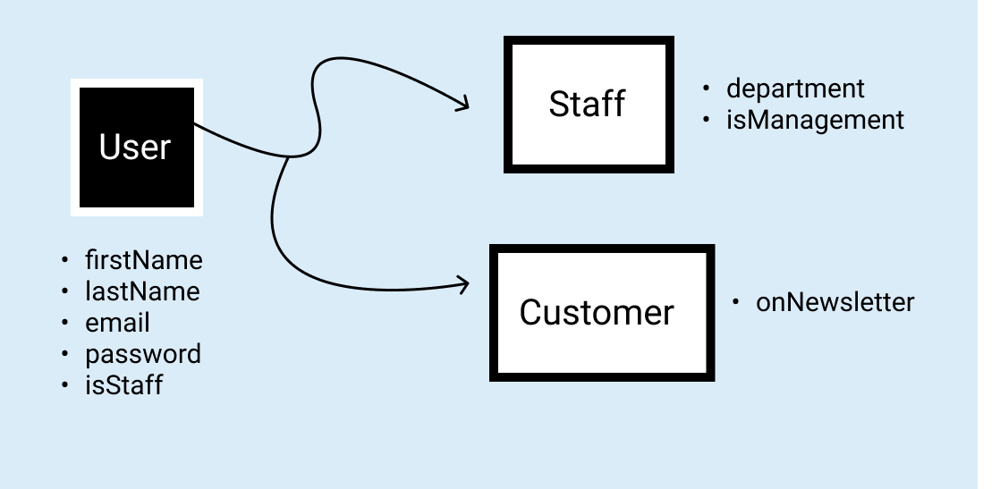
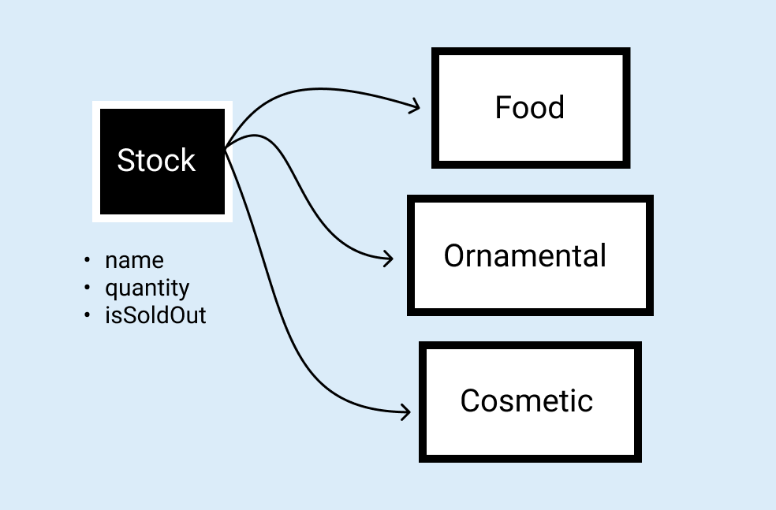

# Garden Management App

This is an application to manage the stock of inventory in a garden. It would be used via a web interface, and primarily serve the garden management staff. Customers of such a business venture, also use the website to view existing stock and indicate purchase intentions.

Inbound information will take the form of inventory names. Garden managers can add and update names and quantities of garden crops. It will also be possible to reduce/ increase inventory as supply requires. Even before a search is triggered, internal pages will display types of crops with their related stock units, upon appropriate authentication being carried out.

## Main application objects

> User Objects

> Stock Objects

